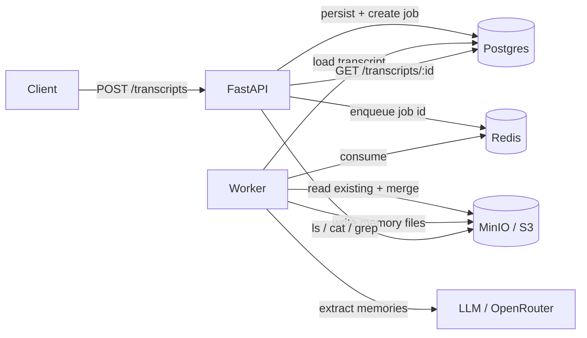

# Memory Wiki

Built for the TwinMind take-home assignment.

A service that ingests conversation transcripts, uses an LLM to distill them into
durable **memories**, stores those memories as a navigable **file tree** in
cloud object storage, and exposes the tree through Unix-style **`ls` / `cat` /
`grep`** REST endpoints.



---

## Quick start (single command)

Requirements: Docker + Docker Compose.

```bash
make up
```

That builds the images and starts everything: **API**, **worker**, **Postgres**,
**Redis**, and **MinIO**. The API is at <http://localhost:8000> (docs at
<http://localhost:8000/docs>), the MinIO console at <http://localhost:9001>
(`minioadmin` / `minioadmin`).

It works out of the box with **no API key**: the LLM defaults to a deterministic
offline stub (`LLM_PROVIDER=fake`) so reviewers can run the full pipeline
immediately.

### Try it

```bash
make seed     # posts a sample transcript, waits, then ls/cat/greps the result
```

or by hand:

```bash
# 1) ingest a transcript
curl -s -X POST localhost:8000/transcripts -H 'content-type: application/json' \
  -d '{"title":"Standup","content":"Sara: Did you finish the Q3 report?\nJohn: I'\''ll send it Friday. I'\''m joining payments next month."}'

# 2) check processing status
curl -s localhost:8000/transcripts/<id>

# 3) browse the memory tree
curl -s 'localhost:8000/memory/ls?path=/'
curl -s 'localhost:8000/memory/ls?path=/people'
curl -s 'localhost:8000/memory/cat?path=/people/john.md'
curl -s 'localhost:8000/memory/grep?q=report&ignore_case=true'
```

### Using a real LLM (OpenRouter)

Create `.env` (or `make up` copies `.env.example` for you) and set:

```bash
LLM_PROVIDER=openrouter
OPENROUTER_API_KEY=sk-or-...           # your key
LLM_MODEL=meta-llama/llama-3.3-70b-instruct:free
```

then `make up` again. The LLM client is provider-agnostic; OpenRouter is the
OpenAI-compatible default, and swapping models/providers is an env change.

> The repo never ships a key. Reviewers either supply their own for real
> generation, or run the bundled `fake` provider to exercise the architecture.

---

## API

| Method | Path | Description |
|---|---|---|
| `POST` | `/transcripts` | Ingest a transcript; returns `{id, job_id, status, duplicate}`. Triggers async memory generation. |
| `GET` | `/transcripts/{id}` | Retrieve a transcript plus its ingestion status. |
| `POST` | `/transcripts/{id}/reprocess` | Re-run memory generation (e.g. to recover a `failed` job). Idempotent. |
| `GET` | `/memory/ls?path=` | List a directory (dirs + files, with size/mtime). |
| `GET` | `/memory/cat?path=` | Read a memory file: parsed metadata + body. |
| `GET` | `/memory/grep?q=&path=&ignore_case=&regex=&context=` | Search memory contents; returns file path, line number, line, and optional context. |
| `GET` | `/health` | Liveness check. |

Errors: `404` (unknown transcript / memory file), `422` (validation, e.g. empty
content), `400` (unsafe path or invalid regex).

---

## Memory design

This is the heart of the system.

### File tree

Memories are organized by entity type so the layout is predictable and
greppable:

```
memories/
  people/<slug>.md         # a person + durable facts about them
  topics/<slug>.md         # ongoing subjects / projects
  events/<slug>.md         # things that happened or are scheduled
  tasks/<slug>.md          # action items / commitments
  facts/<slug>.md          # standalone facts
  preferences/<slug>.md    # the user's likes / habits / choices
```

A memory's location is **deterministic**: `<category>/<slug>.md`. That single
rule is what makes updates and idempotency tractable (the system always knows
where a subject's memory lives).

### File format

Each file is Markdown with YAML frontmatter:

```markdown
---
title: John
category: people
tags: [colleague, payments]
entities: [John]
source_transcripts: [a1b2c3, d4e5f6]
occurred_at: null
created_at: 2026-06-20T09:00:00+00:00
updated_at: 2026-06-21T09:00:00+00:00
---

- John is joining the payments team next month
- John owes Sara the Q3 revenue report by Friday
- John prefers async updates over long meetings
```

Bullets are **atomic, self-contained facts phrased for keyword search** — so
`grep` actually surfaces useful results rather than filenames.

### How new transcripts interact with existing memories: **merge, not append**

When a transcript yields a memory for a subject that already exists, the worker
does an **LLM-driven reconcile**: it feeds the existing bullets + the new facts
to the model and asks it to produce a single coherent, de-duplicated list,
dropping superseded facts (e.g. a changed job title). The alternative
strategies and why they were rejected:

- *New file per transcript* → fragments a subject across many files; grep returns
  noise. Rejected.
- *Blind append* → unbounded growth, duplicates, contradictions left side by
  side. Rejected.
- *Merge (chosen)* → keeps one clean, current memory per subject; best retrieval
  quality. Cost: an extra LLM call per overlapping subject, which is acceptable.

### Idempotency

Every file records the transcript IDs that contributed to it in
`source_transcripts`. Re-processing the same transcript is a **no-op** at two
levels:

1. `POST /transcripts` dedupes by content hash (a unique constraint on the
   ingestion job), so identical content reuses the existing job.
2. The merge step skips any item whose `transcript_id` is already in
   `source_transcripts`.

So a crash-and-retry mid-ingest can never double-write memories.

---

## Background processing

- `POST` persists the transcript + an `ingestion_jobs` row (the **idempotency
  ledger** and source of truth for job state), then pushes the job id to Redis.
- The **worker** consumes job ids, runs extract → merge, and updates job status
  (`pending → processing → done|failed`).
- **Error classification** ([app/llm/errors.py](app/llm/errors.py)): failures are
  split into *retryable* (HTTP 429, 5xx, timeouts, connection errors, transient
  parse failures) and *permanent* (4xx like auth / bad request). Permanent errors
  fail fast instead of burning retries.
- **Retries & backoff:** retryable failures bump `attempts` and re-queue up to
  `MAX_ATTEMPTS`. For rate limits we **honor the provider's `Retry-After`**
  (parsed from the response header or error body); otherwise we use exponential
  backoff with jitter, capped at `MAX_RETRY_DELAY_SECONDS`. Re-queuing happens on
  a background timer so one rate-limited job doesn't block the rest of the queue.
- **Recovery:** failed jobs aren't a dead end — `POST /transcripts/{id}/reprocess`
  (or simply re-`POST`ing the same content) resets and re-queues them once the
  underlying issue clears. On startup the worker also re-enqueues any job left
  `pending` or stuck `processing`, reconciling Redis (transient) with Postgres
  (durable).

> The transcript itself is always safe regardless of LLM outcome: it is written
> to Postgres synchronously on `POST`, before any LLM call. A failed generation
> never loses the transcript, and produces no partial memory files.

---

## Testing

A proper pyramid, all runnable offline (`make test`):

- **Unit** (`tests/unit`): slug/path normalization + traversal rejection,
  frontmatter round-trip, FakeLLM extraction/merge, JSON parsing, the merge
  orchestration (new / idempotent / merge), and `ls`/`cat`/`grep` behavior.
- **Integration** (`tests/integration`): the real boto3 storage code against an
  in-process S3 (`moto`), and the worker `process_job` against SQLite + the
  in-memory store (success, idempotency, retry-then-fail).
- **E2E** (`tests/e2e`): the full HTTP flow — ingest → drain → `ls`/`cat`/`grep`
  — plus duplicate ingest, 404s, path traversal, and validation.

```bash
make test          # full suite in a container
make test-unit     # just the fast offline unit tests
# or locally:
pip install -e ".[dev]" && pytest
```

Edge cases covered: empty/garbage transcript, multi-speaker, duplicate ingest,
overlapping facts triggering a merge, grep no-match / regex / case / context,
nested `ls`, and unsafe paths.

---

## Assumptions

- Transcripts are plain text (any speaker format); the extractor is prompted to
  handle varied content and the offline stub keys off `Speaker: text` lines.
- A single logical user ("second brain" owner); multi-tenant namespacing would
  be a bucket-prefix or top-level directory addition.
- "Cloud object storage" is satisfied by MinIO locally; the same boto3 code
  targets real S3/GCS by changing endpoint/credentials env vars.

## Tradeoffs

- **SQLite/Postgres + `create_all`** instead of Alembic migrations — simpler
  single-command startup; Alembic is the production path.
- **Custom Redis list queue** instead of Celery/arq — fewer moving parts and it
  makes the retry/idempotency/recovery logic explicit and testable, which is
  exactly what's being evaluated.
- **`grep` scans objects under the prefix** — correct and simple for this scale;
  an index would be needed at large volume (see below).
- **Merge costs an extra LLM call** per overlapping subject — paid for cleaner,
  more retrievable memories.

## What I'd do next

The take-home scoped retrieval to **`ls` / `cat` / `grep`** over object storage.
That was the right call: predictable, easy to debug, and enough to prove the
ingest → merge → browse pipeline. At scale, linear scans over every memory file
stop being acceptable — the next step is a **search index built on top of the
same markdown tree**, not a rewrite of it.

The worker already emits **atomic bullet memories**; each bullet is a natural
index chunk. MinIO stays the **source of truth**; the index is a derived,
rebuildable cache.

### Phase 1 — Keyword search (Postgres FTS)

- Index each bullet on write (path, line, text, metadata).
- Add `GET /memory/search?q=…&mode=keyword` backed by Postgres full-text search.
- Keeps infra minimal — Postgres is already in the stack.

### Phase 2 — Semantic recall (embeddings)

- Embed chunks on write; store vectors in **pgvector** or a dedicated store
  (Qdrant, Pinecone).
- Same endpoint with `mode=semantic` for fuzzy queries ("that team switch
  conversation") that `grep` would miss.

### Phase 3 — Grounded answers (RAG)

- `POST /memory/ask` — retrieve top-k chunks, inject into an LLM prompt, return
  an answer **with citations** back to `/people/john.md` (or similar).

### Also on the list

- **Eval harness** — labeled transcripts; score extraction, merge quality, and
  retrieval hit-rate as prompts/models change.
- **Streaming ingest** — chunk transcripts as they arrive instead of batch POST.
- **Production ops** — Alembic migrations, tracing/metrics, auth/multi-tenancy,
  dead-letter queue for poison jobs.

```
Transcript → Worker → MinIO (.md)     ← canonical (what we have today)
                  ↘
                   Postgres FTS + vectors  ← derived index (next)
                              ↘
                         /search, /ask
```

